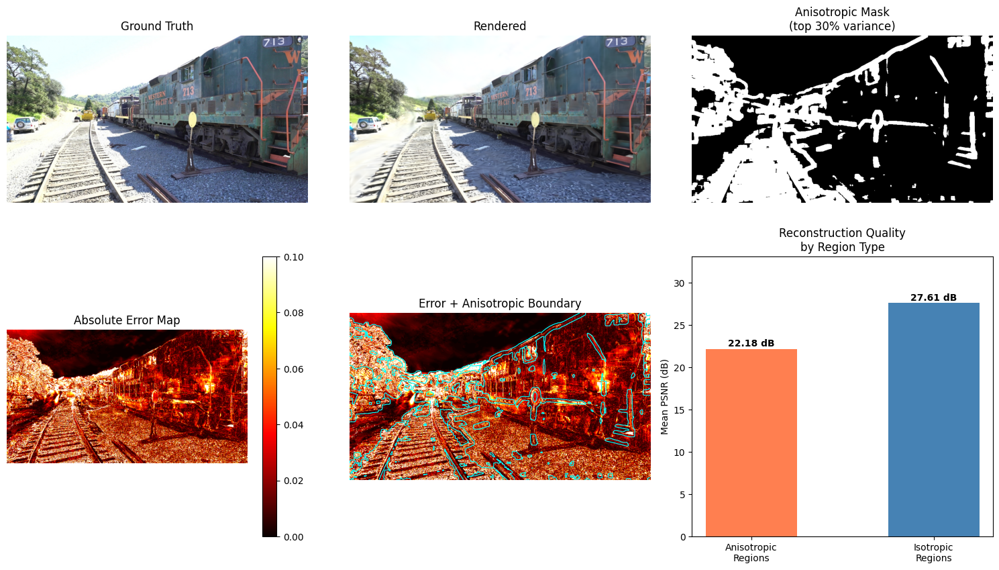

# Anisotropy Analysis in 3D Gaussian Splatting
STA306 Statistical Computing Project (Winter 2026)

## Render Example

https://github.com/user-attachments/assets/a48ceb8b-5402-49c4-b596-87f117883b6a

---



The figure above presents a visual breakdown of reconstruction quality in 3D Gaussian Splatting through the lens of anisotropy. The top row compares the ground truth and rendered output for a training scene, alongside an anisotropic mask highlighting the top 30% of highest-variance regions. The bottom row shows the absolute error map (brighter = higher error), an error map overlaid with anisotropic boundaries (cyan contours), and a bar chart of mean PSNR by region type.

[Report](report/STA306_Report.pdf)

---

## Instructions to Run

### Requirements
 
```
pip install plyfile numpy matplotlib pandas scipy scikit-learn scikit-image pillow
```
---

NOTE: Replace `<run_id>`

### 1 - Install
 
```bash
bash setup.sh
```
 
### 2 - Train
 
```bash
python gaussian-splatting/train.py -s gaussian-splatting/tandt/train
```
 
Output in `gaussian-splatting/output/<run_id>/`.
 
### 3 - Analyse Gaussians
 
```bash
python analyze_gaussians.py \
    --ply gaussian-splatting/output/<run_id>/point_cloud/iteration_30000/point_cloud.ply \
    --out_dir results/
```
 
Saves plots and `anisotropy_summary.csv` to `results/`.
 
### 4 - Render
 
```bash
python gaussian-splatting/render.py -m gaussian-splatting/output/<run_id>
```
 
### 5 - Render quality evalualtion
 
```bash
python evaluate_renders.py \
    --model_dir gaussian-splatting/output/<run_id> \
    --out_dir results/
```
 
Saves `psnr_results.csv` and quality plots to `results/`.
 
### 6 - Viewer
 
```bash
# Convert
python convert_ply_to_splat.py \
    --ply gaussian-splatting/output/<run_id>/point_cloud/iteration_30000/point_cloud.ply \
    --out viewer/splat.splat
 
# Clone viewer repo
git clone https://github.com/camenduru/splat viewer
 
# Serve
python serve_splat.py --dir viewer
# opens http://localhost:7860 in browser
```
